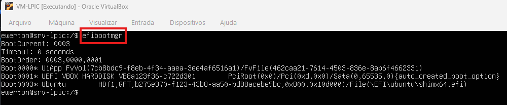
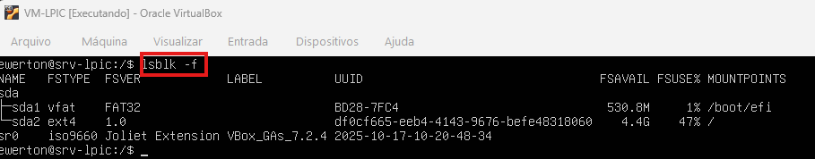
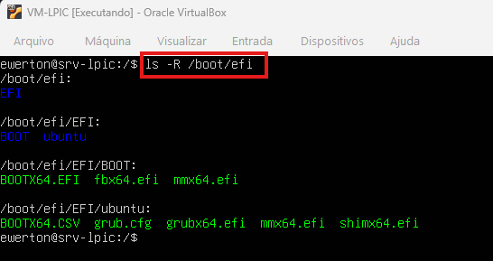

Laboratório: Análise de Entradas de Firmware UEFI no Linux

Este laboratório descreve o processo de análise das variáveis de inicialização do firmware UEFI em sistemas Linux. O ambiente utilizado é o VirtualBox, uma vez que a máquina atual que roda o Proxmox é o padrão BIOS, cujo processo de execução difere do padrão UEFI.

1. Conceitos Fundamentais: UEFI vs. BIOS

Diferente do legado BIOS, que executa o processo de POST e busca o registro de inicialização no MBR (primeiros 512 bytes do disco), o UEFI realiza o POST e consulta as variáveis armazenadas na NVRAM (memória não volátil) da placa-mãe. A partir dessas informações, o firmware localiza o caminho do carregador de inicialização.

Para visualizar as variáveis armazenadas na NVRAM, utiliza-se o comando: efibootmgr

2. Análise da Saída efibootmgr

Com base na execução do comando, identificamos os seguintes parâmetros:

BootCurrent: Indica a entrada de boot utilizada na sessão atual.

Timeout: Tempo de espera (em segundos) do menu de firmware antes de carregar a opção padrão.

BootOrder: Define a hierarquia de inicialização (ex: 0003, 0000, 0001). O sistema tenta iniciar a primeira opção; em caso de falha, segue para a próxima.

Asterisco (\*): Indica que a entrada está ativa.

Exemplo da entrada 0003 (Ubuntu): "Ubuntu HD(1,GPT,b275e370...)/File(\\EFI\\ubuntu\\shimx64.efi)"

HD(1,GPT,...): O firmware identifica a primeira partição de um disco com tabela GPT. O código alfanumérico representa o UUID da partição ESP.

File(\\EFI\\ubuntu\\shimx64.efi): O caminho absoluto dentro da partição para o executável do firmware.

 3. Verificação de Partições e Sistema de Arquivos

Utilizamos o comando abaixo para visualizar a estrutura de blocos e sistemas de arquivos: lsblk -f

Observa-se que a partição /dev/sda1 (ESP) utiliza o formato FAT32, enquanto /dev/sda2 utiliza EXT4.

Nota Técnica: A partição ESP (EFI System Partition) deve ser obrigatoriamente FAT32, conforme as especificações UEFI. Isso ocorre porque o firmware precisa ler esta partição antes do carregamento do sistema operacional, exigindo um sistema de arquivos simples que dispense drivers complexos.

A partição ESP é montada em /boot/efi. É importante destacar que esta partição:

NÃO contém o Kernel.

NÃO contém o diretório /etc.

NÃO é o diretório /boot.

Contém apenas os executáveis UEFI.

 4. Estrutura de Arquivos na Partição ESP

Listando o conteúdo de forma recursiva: ls -R /boot/efi

No caminho /boot/efi/EFI/ubuntu, encontramos os arquivos:

shimx64.efi: Responsável pela segurança (Secure Boot), validando o próximo binário.

grubx64.efi: O carregador de inicialização propriamente dito.

O firmware UEFI lê a partição FAT32 e executa o .efi. Contudo, ele não possui suporte nativo para ler a partição EXT4 onde está o Ubuntu. O grubx64.efi é carregado na RAM, utiliza um arquivo de configuração temporário (Early Config) para localizar a partição raiz e, então, carrega o menu completo do GRUB e o Kernel.

 5. Manipulação de Entradas na NVRAM

Para criar uma nova entrada na NVRAM sem substituir a atual, utilizamos:

sudo efibootmgr -c -d /dev/sda -p 1 -L "Linux-LAB" -l '\\EFI\\ubuntu\\grubx64.efi'

Parâmetros:

-c: Create (Criar).

-d: Disco de destino.

-p: Número da partição ESP.

-L: Label (Nome de exibição).

-l: Path do carregador EFI.

Após a criação, validamos com efibootmgr. Ao reiniciar, o sistema assumirá a nova entrada conforme a ordem de prioridade definida.

6. Alteração da Ordem de Inicialização (Boot Order)

Para forçar uma nova hierarquia de boot manualmente:

sudo efibootmgr -o 0003,0002,0001,0000

A alteração no BootOrder é refletida imediatamente na saída do comando e será aplicada no próximo ciclo de inicialização do hardware.

Antes do reboot

Após o reboot 

